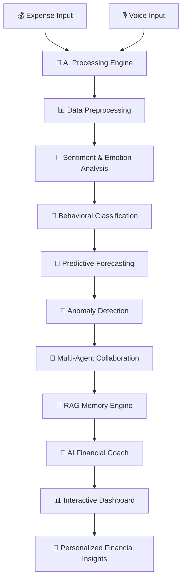

<!-- ============================================ -->
<!--              SpendWise Banner                -->
<!-- ============================================ -->

<div align="center">

# 💰 SpendWise

# AI-Based Behavioral Finance & Decision System

## Track Smarter. Spend Wiser. Live Better. 🧠

</div>

---

<p align="center">


</p>

---

# 📖 Project Description

**SpendWise** is an AI-powered Behavioral Finance and Decision System designed to help users **Track, Understand, and Optimize** their personal finances through the power of **Artificial Intelligence, Behavioral Analytics, and Agentic AI**.

Unlike traditional budgeting applications that only record transactions, SpendWise focuses on the **psychological and emotional dimensions** of spending behavior. The system combines **Machine Learning, Sentiment Analysis, Forecasting, Anomaly Detection, Multi-Agent Collaboration, and RAG-based Memory** to provide proactive financial intelligence and personalized recommendations.

The platform empowers users to make informed financial decisions by understanding **why** they spend, not just **where** they spend.

---

# ✨ Key Highlights

- 💰 AI-Powered Behavioral Finance Intelligence
- 🎙️ Voice-Based Expense Entry
- 🧠 Sentiment & Emotion Analysis
- 🎯 Behavioral Spending Classification
- 🤖 AI Financial Coaching Assistant
- 📈 Personalized Savings Recommendations
- 💡 Budget Planning & Optimization
- 🏥 Financial Health Scoring
- 🚨 Overspending Detection & Alerts
- 🔮 Expense Forecasting & Trend Prediction
- 🤝 Multi-Agent Financial Intelligence
- 🧩 RAG-Based Memory System
- 📊 Interactive Analytics Dashboard
- 🔍 Anomaly Detection for Unusual Spending
- 🎯 Goal & Strategy Planning System

---

# 🏗 System Architecture

SpendWise follows a modular AI behavioral finance pipeline that transforms raw expense data into actionable financial intelligence through sentiment analysis, predictive modeling, multi-agent collaboration, and contextual memory.



### 🔄 Application Workflow

1. Enter expenses manually or through voice interaction.
2. System processes and categorizes financial transactions.
3. NLP models analyze spending descriptions and emotions.
4. Behavioral patterns are identified and classified.
5. Machine learning models forecast future expenses.
6. Anomaly detection identifies unusual spending behavior.
7. Multi-agent AI collaborates to generate recommendations.
8. RAG-based memory engine provides contextual insights.
9. AI Financial Coach offers personalized guidance.
10. Interactive dashboard visualizes financial health.

---

# 📊 Feature Comparison

| Feature | Traditional Budgeting Apps | SpendWise |
|:---|:---:|:---:|
| Expense Tracking | ✅ | ✅ |
| Voice-Based Entry | ❌ | ✅ |
| Sentiment Analysis | ❌ | ✅ |
| Behavioral Classification | ❌ | ✅ |
| AI Financial Coach | ❌ | ✅ |
| Multi-Agent Collaboration | ❌ | ✅ |
| RAG-Based Memory | ❌ | ✅ |
| Anomaly Detection | ❌ | ✅ |
| Expense Forecasting | Basic | ✅ ML-Powered |
| Financial Health Scoring | ❌ | ✅ |
| Personalized Recommendations | ❌ | ✅ |
| Goal Planning | Basic | ✅ AI-Driven |

---

# ✨ Core Features

## 🎙️ Voice-Based Expense Entry

- Speech recognition integration
- Natural language expense recording
- Voice-to-text financial input
- Hands-free expense tracking

---

## 🧠 Sentiment & Emotion Analysis

- Emotional spending detection
- Stress-driven purchase identification
- Happiness/Reward spending analysis
- Risk-oriented financial behavior detection

---

## 🎯 Behavioral Spending Classification

- Impulsive Spending Detection
- Reward-Based Spending
- Normal/Essential Spending
- Emotional Spending Patterns
- Stress-driven financial behavior analysis

---

## 🤖 AI Financial Coaching Assistant

- Conversational financial advice
- Contextual recommendations
- Financial improvement strategies
- Goal setting and habit development
- Personalized financial guidance

---

## 🤝 Multi-Agent AI Collaboration

### Five Specialized AI Agents

| Agent | Function |
|:---|:---|
| 💰 Savings Agent | Savings optimization |
| 📊 Risk Analysis Agent | Financial risk detection |
| 😊 Emotion Analysis Agent | Behavioral sentiment analysis |
| 📋 Budget Planning Agent | Budget optimization |
| 📈 Investment Agent | Investment suggestions |

These agents collaborate through an **Agentic AI Controller** to generate intelligent financial recommendations.

---

## 🧩 RAG-Based Memory Engine

- Stores contextual financial history
- Retrieves previous financial decisions
- Memory-aware recommendations
- Long-term personalized insights

---

## 🔮 Predictive Forecasting

- Future expense prediction
- Savings opportunity estimation
- Financial health score calculation
- Real-time overspending detection

---

## 🚨 Anomaly Detection

- Unusual spending identification
- Behavioral anomaly detection
- Risk alert generation
- Real-time notifications

---

## 📊 Interactive Analytics Dashboard

- Expense distribution visualization
- Behavioral pattern analysis
- Financial health monitoring
- Trend prediction charts
- Budget vs Actual comparison

---

# 🛠 Technology Stack

| Layer | Technology |
|:---|:---|
| Programming Language | Python 3.11 |
| User Interface | Streamlit |
| Natural Language Processing | Hugging Face Transformers |
| Sentiment Analysis | TextBlob / NLP |
| Voice Processing | Speech Recognition / Whisper |
| Machine Learning | Scikit-Learn |
| Data Processing | Pandas + NumPy |
| Data Visualization | Plotly + Matplotlib |
| Vector Database | ChromaDB |
| Database | SQLite |
| Agentic AI | Multi-Agent Architecture |
| RAG Engine | Custom Implementation |
| Deployment | Streamlit Cloud |
| Version Control | Git & GitHub |

---
# 📂 Project Structure

```text
SPENDWISE-AI-BASED-BEHAVIORAL-FINANCE-AND-DECISION-SYSTEM/
│
├── app.py                              # Main Streamlit Application
├── requirements.txt                    # Project Dependencies
├── README.md                           # Documentation
├── .gitignore
│
├── data/
│   └── spendwise.db                    # SQLite Database
│
├── utils/
│   ├── advanced_ai.py
│   ├── agent.py
│   ├── ai_coach.py
│   ├── anomaly_detector.py
│   ├── autonomous_agent.py
│   ├── behavior.py
│   ├── database.py
│   ├── finance_chat.py
│   ├── goal_planner.py
│   ├── llm_engine.py
│   ├── memory.py
│   ├── multi_agent.py
│   ├── predictor.py
│   ├── rag_engine.py
│   ├── recommendations.py
│   ├── report_generator.py
│   ├── sentiment.py
│   ├── speech.py
│   ├── strategy_engine.py
│   ├── voice_assistant.py
│   └── whisper_engine.py
│
├── vector_store/
│   └── chroma.sqlite3
│
├── debug_imports.py
├── test_llm.py
└── test_voice.py
```

---

# 📸 Application Preview


---


---


---


---


---


---


---


---


---


---


---


---


---


---

The screenshots above demonstrate **SpendWise's** complete behavioral finance workflow—from expense entry and voice interaction to sentiment analysis, behavioral classification, predictive forecasting, anomaly detection, multi-agent collaboration, AI financial coaching, and personalized financial recommendations.


---
# ⚙ Installation

## Prerequisites

- Python 3.11+
- pip

---

### Clone Repository

```bash
git clone https://github.com/Keya3639/SPENDWISE-AI-BASED-BEHAVIORAL-FINANCE-AND-DECISION-SYSTEM.git

cd SPENDWISE-AI-BASED-BEHAVIORAL-FINANCE-AND-DECISION-SYSTEM
```

---

### Install Dependencies

```bash
pip install -r requirements.txt
```

---

### Run Application

```bash
streamlit run app.py
```

---

# 🚀 Demo Workflow

| Step | Action |
|:--:|:---|
| 1 | Enter Expense Manually or via Voice |
| 2 | AI Processes Financial Data |
| 3 | Sentiment & Emotion Analysis |
| 4 | Behavioral Pattern Classification |
| 5 | Expense Forecasting |
| 6 | Anomaly Detection |
| 7 | Multi-Agent Collaboration |
| 8 | AI Financial Coach Interaction |
| 9 | View Interactive Dashboard |
| 10 | Get Personalized Recommendations |

---

# 🌟 Why SpendWise?

Unlike traditional budgeting applications that simply record expenses, **SpendWise** combines **Artificial Intelligence, Behavioral Finance, Natural Language Processing, Sentiment Analysis, Predictive Analytics, Multi-Agent Collaboration, and RAG-based Memory** to understand the psychology behind financial decisions.

SpendWise empowers users to:

- 💰 Track financial and emotional spending habits
- 🧠 Understand the psychology behind purchases
- 📊 Monitor financial health intelligently
- 🎯 Receive personalized financial recommendations
- 🤖 Interact with an AI Financial Coach
- 📈 Improve long-term financial wellness

**SpendWise doesn't just track your money—it understands your financial behavior.**

---

# 📈 Advantages

- 🧠 AI-driven behavioral finance analysis
- 🎙️ Voice-based expense recording
- 😊 Emotion-aware spending detection
- 📊 Financial health scoring
- 🔮 Intelligent expense forecasting
- 🚨 Anomaly detection for unusual transactions
- 🤝 Multi-Agent financial intelligence
- 🧩 Context-aware RAG memory
- 📈 Personalized financial coaching
- 💡 Smart budgeting strategies
- 🎨 Interactive analytics dashboard
- ⚡ Lightweight CPU-only execution

---

# ⚠️ Limitations

- Prediction quality depends on available historical data.
- Financial advice is AI-generated and should not replace professional consultation.
- Voice recognition accuracy may vary depending on audio quality.
- Real-time banking APIs are not integrated.
- Investment recommendations are educational in nature.
- Future predictions are probabilistic rather than guaranteed.

---

# 🌍 Real-World Applications

- 💰 Personal Finance Management
- 🏦 FinTech Platforms
- 📊 Expense Analytics
- 🧠 Behavioral Finance Research
- 🎯 Smart Budget Planning
- 💳 Spending Habit Analysis
- 📈 Financial Forecasting
- 🤖 AI Financial Assistants
- 🎓 Educational Finance Platforms
- 💼 Intelligent Wealth Management Systems

---

# 🔮 Future Enhancements

| Phase | Features |
|:---|:---|
| Phase 1 | Banking API Integration |
| Phase 2 | Advanced Deep Learning Forecasting |
| Phase 3 | Multilingual AI Financial Assistant |
| Phase 4 | Mobile Application |
| Phase 5 | Explainable AI Recommendations |
| Phase 6 | Cloud Deployment |
| Phase 7 | Smart Investment Advisor |
| Phase 8 | Subscription & Bill Management |
| Phase 9 | Autonomous Financial Agents |
| Phase 10 | Enterprise Finance Dashboard |

---

# 🛣 Project Roadmap

- ✅ Expense Tracking
- ✅ Voice-Based Expense Entry
- ✅ Sentiment Analysis
- ✅ Behavioral Finance Engine
- ✅ AI Financial Coach
- ✅ Expense Forecasting
- ✅ Financial Health Score
- ✅ Multi-Agent AI
- ✅ RAG Memory Engine
- ✅ Interactive Dashboard
- 🔄 Banking Integration
- 🔄 Mobile Application
- 🔄 Cloud Deployment

---

# 🎯 Conclusion

**SpendWise** demonstrates how **Artificial Intelligence, Behavioral Finance, Machine Learning, and Agentic AI** can redefine personal financial management.

Rather than simply recording transactions, SpendWise understands the behavioral and emotional factors influencing spending habits. By integrating sentiment analysis, predictive analytics, contextual memory, and intelligent financial coaching, the platform delivers meaningful insights that encourage smarter financial decisions.

SpendWise represents the next generation of AI-powered financial wellness systems where technology helps users build healthier financial habits through intelligent guidance rather than passive expense tracking.

---

# 👩‍💻 Developer

## Keya Das

**MCA (Artificial Intelligence & Data Science)**

🌐 **GitHub**

https://github.com/Keya3639

📧 **Email**

keyakarunamoydas@gmail.com

---

# 🙏 Acknowledgements

This project was developed using the following open-source technologies and frameworks:

- 🧠 Hugging Face Transformers
- 🤗 Sentence Transformers
- 🎨 Streamlit
- 🐍 Python
- 🐼 Pandas
- 📊 NumPy
- 🤖 Scikit-Learn
- 📈 Plotly
- 🗄 SQLite
- 🧩 ChromaDB
- 🎙 Whisper
- 🌍 Open Source Community

---

<div align="center">

# 💰 SpendWise

### Track Smarter. Spend Wiser. Live Better. 🧠

**Built with ❤️ using**

**Python • Streamlit • Hugging Face Transformers • Sentence Transformers • Pandas • NumPy • Scikit-Learn • Plotly • ChromaDB • SQLite**

</div>

